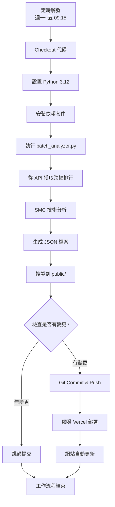

# GitHub Actions 自動化工作流程

本專案使用 GitHub Actions 實現股票數據的自動更新。

## 📅 執行時間表

```
週一到週五 09:15 (台灣時間)
├── 01:15 UTC (GitHub Actions 執行時間)
└── 自動觸發工作流程
```

## 🔄 工作流程



## 🛠️ 工作流程檔案

位置: `.github/workflows/update-stock-data.yml`

### 主要步驟

1. **Checkout Repository**
   - 拉取最新代碼

2. **Setup Python 3.12**
   - 安裝 Python 環境
   - 使用 pip cache 加速

3. **Install Dependencies**
   ```bash
   pip install numpy>=1.26.0 pandas>=2.0.0 requests>=2.31.0
   pip install --no-deps smartmoneyconcepts
   ```

4. **Run Analysis**
   ```bash
   cd backend
   python batch_analyzer.py
   ```

5. **Copy Files**
   ```bash
   cp -f backend/output/*.json public/
   ```

6. **Auto Commit**
   - 只在有變更時提交
   - 使用 github-actions[bot] 身份
   - 提交訊息包含台灣時間戳記

## 🎯 手動觸發

除了定時執行,您也可以手動觸發工作流程:

1. 前往 GitHub repository
2. 點擊 **Actions** 標籤
3. 選擇 **Update Stock Data** 工作流程
4. 點擊 **Run workflow** 下拉選單
5. 選擇分支 (通常是 `main`)
6. 點擊綠色的 **Run workflow** 按鈕

## 📊 監控執行狀態

### 查看執行歷史

在 GitHub Actions 頁面可以看到:
- ✅ 成功執行的記錄 (綠色勾勾)
- ❌ 失敗的記錄 (紅色叉叉)
- 🟡 執行中的記錄 (黃色圓圈)

### 查看詳細日誌

點擊任一執行記錄可以看到:
- 每個步驟的執行時間
- 詳細的輸出日誌
- 錯誤訊息 (如果有)

## ⚙️ 時區說明

GitHub Actions 使用 **UTC 時間**,台灣時間 (UTC+8) 需要減 8 小時:

| 台灣時間 | UTC 時間 | Cron 表達式 |
|---------|---------|------------|
| 09:15   | 01:15   | `15 1 * * 1-5` |

### Cron 表達式解析

```
15 1 * * 1-5
│  │ │ │ └─── 星期 (1-5 = 週一到週五)
│  │ │ └───── 月份 (* = 每月)
│  │ └─────── 日期 (* = 每日)
│  └───────── 小時 (1 = UTC 01:00)
└──────────── 分鐘 (15 = 15分)
```

## 🔐 權限設定

工作流程使用內建的 `GITHUB_TOKEN`,具有以下權限:
- ✅ 讀取代碼
- ✅ 寫入代碼 (提交變更)
- ✅ 觸發其他工作流程

不需要額外設定 Personal Access Token。

## 🐛 故障排除

### 工作流程執行失敗

1. **Python 依賴安裝失敗**
   - 檢查 `requirements.txt` 是否正確
   - 查看是否有版本衝突

2. **API 請求失敗**
   - 檢查 API 是否可用
   - 查看網路連線狀態

3. **Git Push 失敗**
   - 檢查 repository 權限
   - 確認沒有保護分支規則阻擋

### 數據沒有更新

1. **檢查執行時間**
   - 確認是否在週一到週五
   - 查看 Actions 頁面的執行記錄

2. **檢查數據變更**
   - 如果 API 返回相同數據,不會產生新提交
   - 查看日誌中的 "No changes detected" 訊息

## 💡 最佳實踐

1. **定期檢查執行狀態**
   - 每週查看一次 Actions 頁面
   - 確保自動化正常運作

2. **保持依賴更新**
   - 定期更新 Python 套件版本
   - 關注安全性更新

3. **監控 API 配額**
   - GitHub Actions 有免費額度限制
   - 公開 repository 通常不受限制

## 📚 相關資源

- [GitHub Actions 文檔](https://docs.github.com/en/actions)
- [Cron 表達式生成器](https://crontab.guru/)
- [工作流程語法參考](https://docs.github.com/en/actions/using-workflows/workflow-syntax-for-github-actions)
